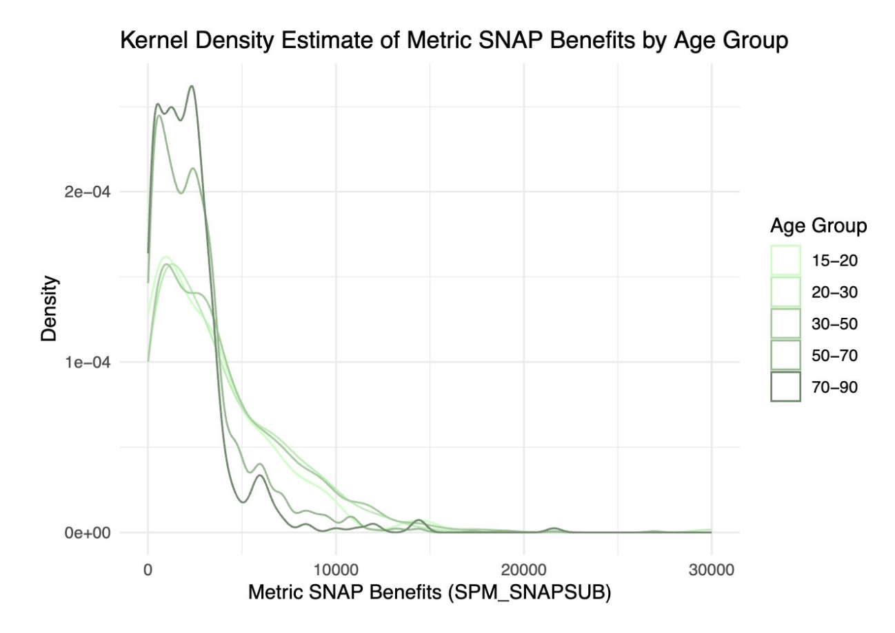
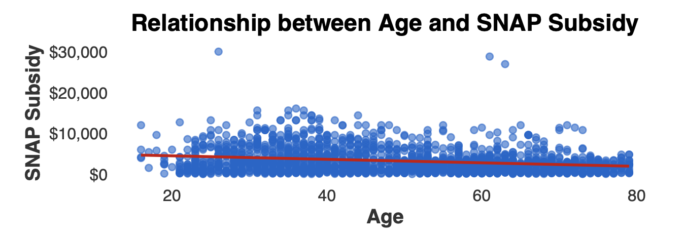

# Effects of Aging on SNAP Subsidy
_Taylor Han, Alec Naidoo, Shruti Gupta_

**Introduction**

Social welfare programs, such as the Supplemental Nutrition Assistance Program (SNAP), play a critical role in supporting vulnerable populations in the United States. However, ensuring equitable access to these programs poses a significant challenge. Opponents of SNAP funding argue that the program is abused by recipients, encourages dependency by certain populations, or acts as a disincentive to work. Our analysis examines demographics targeted by welfare programs to inform political discourse around the effectiveness and accessibility of similar public assistance initiatives. In particular, we address the research question:

**Research Question**

How does the distribution of SNAP income vary across ages, utilizing linear regression to reveal underlying age-related trends?

**Dataset**

The dataset for our analysis comes from the Annual Social and Economic Supplement (ASEC) of the Current Population Survey (CPS). The survey is administered at the household level, and a “reference person” generally responds on behalf of their household. It also employs the supplementary poverty measure (SPM) to more accurately measure poverty nationwide by taking into account in-kind benefits and regional economic differences. SPM statistics are compiled for each person within a unit. A unit expands upon the traditional family unit used in the original poverty measure by including cohabiters that may share resources. One person is recorded as the head of each unit.

**Results**

Our initial regression analysis examines the relationship between SNAP subsidy and recipient age and reveals a statistically significant, negative effect of age on SNAP subsidy. This suggests that, on average, each additional year of age is associated with a decrease of -42.86 in SNAP subsidy.

**Resources**

* [**Presentation**](https://github.com/Alec12/Effects-of-Aging-on-SNAP-subsidy/blob/main/Analyzing_SNAP_Income_A_Descriptive_Analysis.pdf)
* [**Research Paper**](https://github.com/Alec12/Effects-of-Aging-on-SNAP-subsidy/blob/main/Report_Deliverable.pdf) 
* [**R Code**](https://github.com/Alec12/Effects-of-Aging-on-SNAP-subsidy/blob/main/R_Code_Deliverable.Rmd)